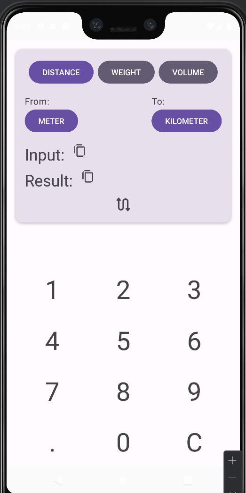
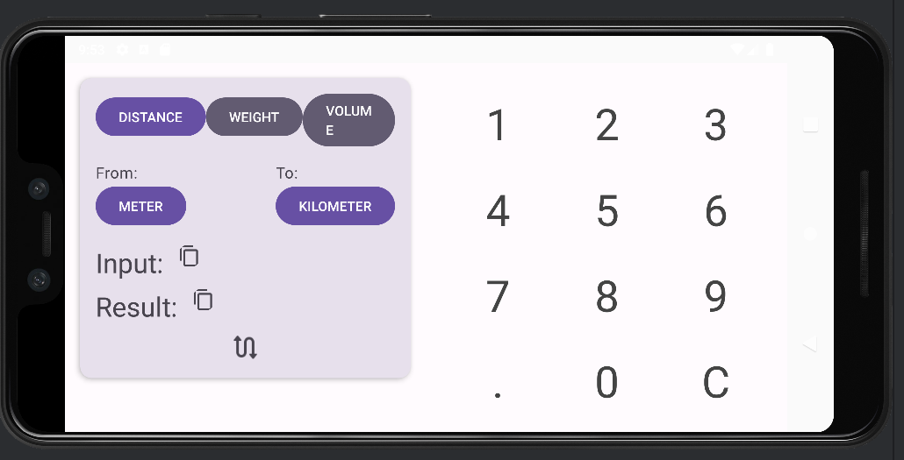

# Unit Converter - Kotlin Multiplatform Application

A versatile **Unit Converter** application built using **Kotlin Multiplatform**. This app allows users to convert units across three different categories: **distance**, **weight**, and **volume**. Each category includes three distinct units for conversion. The app features a calculator-like numeric pad and two fields for original and converted values. Users cannot modify the data fields using the default system keyboard, ensuring a seamless experience.

## Features

- **Three Unit Categories**:
  - **Distance**: Convert between meters, kilometers, and miles.
  - **Weight**: Convert between grams, kilograms, and pounds.
  - **Volume**: Convert between liters, milliliters, and gallons.

- **User Interface**:
  - **Portrait Orientation**: Fragments are arranged in a row with the keyboard below the data fragment.
  - **Landscape Orientation**: Fragments are aligned side by side.

- **Premium Build Flavour**:
  - A special **premium** build flavour is available for enhanced features.

- **Swap Units**:
  - A button to switch the initial and converted values (and units) and vice-versa.

- **Copy to Clipboard**:
  - Buttons to copy the current value to the clipboard are located near each data field.

## Screenshots

### Portrait Orientation


### Landscape Orientation


## Getting Started

To get started with the Unit Converter application, follow these steps:

1. **Clone the Repository**:
   ```bash
   git clone https://github.com/whiteprincewithobsession/Simple-Mobile-Unit-Converter.git
   ```
   **Open the Project:**
   Open the project in Android Studio or your preferred IDE.

   **Build and Run:**
   Select the desired build flavour (e.g., premium) and run the application on your preferred platform.
   
3. **Download APK build**:
   Find APK in Tags (Premium build and Basic build)
   
  
